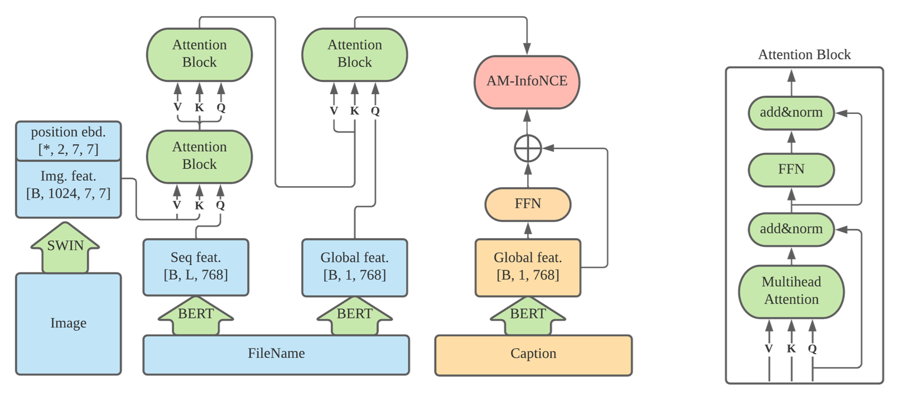
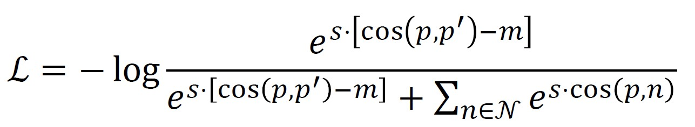

# ImageTextMatching-Pytorch
Solution for kaggle competition Wikipedia - Image/Caption Matching
---

### Model

I use Swin and Bert as backbone for image/text features extraction, and fuse such features with cross-attention modules.


The network is trained with single loss: Arc-InfoNCE, whose cost function is:



### Data

I use 6.5M image/caption pairs to train the network, which can be downloaded from [here](https://storage.cloud.google.com/wikimedia-image-caption-public/image_data_train.tar).

### Requirements

```text
python3
pytorch >= 1.3
mmcv
mmcls
tqdm
```

### Results

After training for 8 epochs, the model can achieve NDCG@5 with 0.59~0.6 on testset. 
If you normalize the similarity score for each caption over all images with Softmax, 
the result can be further improved to 0.61+.


### Inference
 
1. Download pretrained model

comming soon...

2. run inference

```bash
cd image+name_caption_infonce
python inference.py 
```
